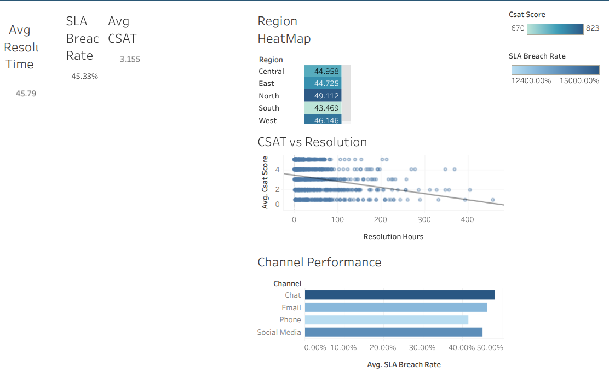

# Customer Support Analytics & SLA Optimization

## 📌 Overview
End-to-end Business Intelligence project analyzing 1000+ customer support tickets to uncover performance gaps, SLA risks, and customer satisfaction drivers.

The project transforms raw operational data into actionable insights using Python (Pandas) and Tableau, enabling data-driven decision making.

---

## 🎯 Objective
- Identify key drivers of SLA breaches
- Analyze factors impacting customer satisfaction (CSAT)
- Evaluate performance across channels, regions, and agents
- Deliver insights through an interactive dashboard

---

## ⚙️ Tech Stack
- Python (Pandas) → Data Cleaning & Feature Engineering  
- SQL Concepts → KPI Logic & Aggregations  
- Tableau Cloud → Dashboard & Visualization  

---

## 🧱 Approach

**1. Data Preparation**
- Cleaned and validated ticket-level data
- Handled missing values and corrected data types
- Recomputed SLA logic to ensure accuracy

**2. Feature Engineering**
- Created `response_delay_flag` (Delayed vs On-Time)
- Built `resolution_speed_category` (Fast / Medium / Slow)
- Derived SLA compliance metrics for analysis

**3. KPI Analysis**
- SLA Breach Rate → **45.33%**
- Avg Resolution Time → **45.79 hrs**
- Avg CSAT → **3.16**

**4. Insight Generation**
- Segmented performance by channel, region, and agent
- Performed correlation analysis between time metrics and CSAT
- Identified operational bottlenecks and inefficiencies

---

## 🔍 Key Business Insights

- **Response delay is the primary driver of SLA breaches**
  - Breach rate increases from **~42% → ~60%** when responses are delayed

- **Resolution speed directly impacts customer satisfaction**
  - Fast tickets → CSAT ~3.57  
  - Slow tickets → CSAT ~2.84  

- **Time-based metrics negatively affect customer experience**
  - CSAT vs Resolution Time → **-0.26 correlation**

- **Channel-level inefficiencies observed**
  - Chat and Email show relatively higher SLA breach rates

---

## 📊 Dashboard

👉 **Live Dashboard:** [Add Tableau Link Here]

**Key Views:**
- KPI Overview (SLA, Resolution Time, CSAT)
- Channel-wise SLA Performance
- Region-wise Performance Heatmap
- CSAT vs Resolution Time (Correlation)
- Response Delay Impact Analysis



---

## 💡 Business Impact

- Identified **first response delay** as the highest-impact improvement area  
- Highlighted need for **prioritization and faster response handling**  
- Provided actionable insights to improve both **SLA compliance and CSAT**  

---

## 🚀 How to Run

```bash
pip install -r requirements.txt
python src/app.py